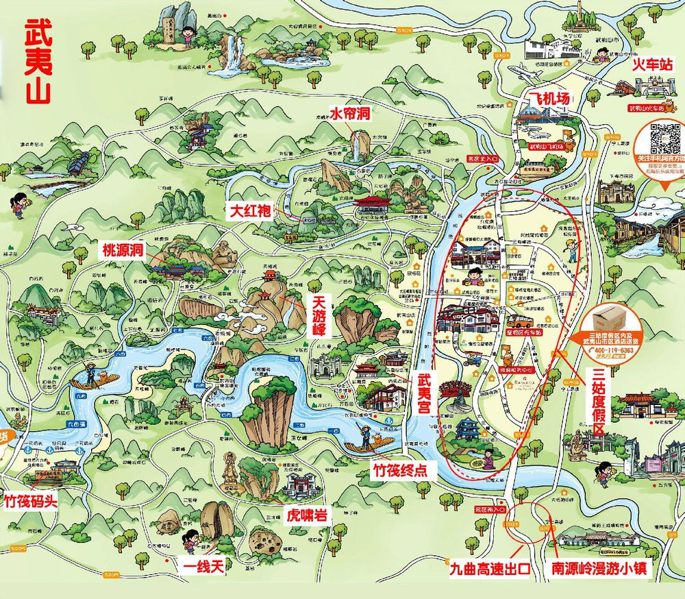
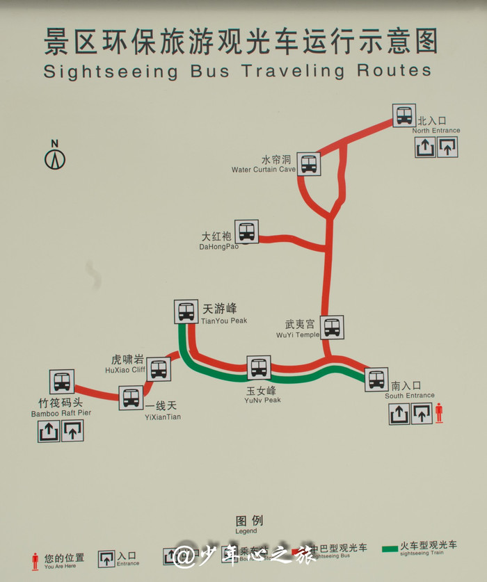
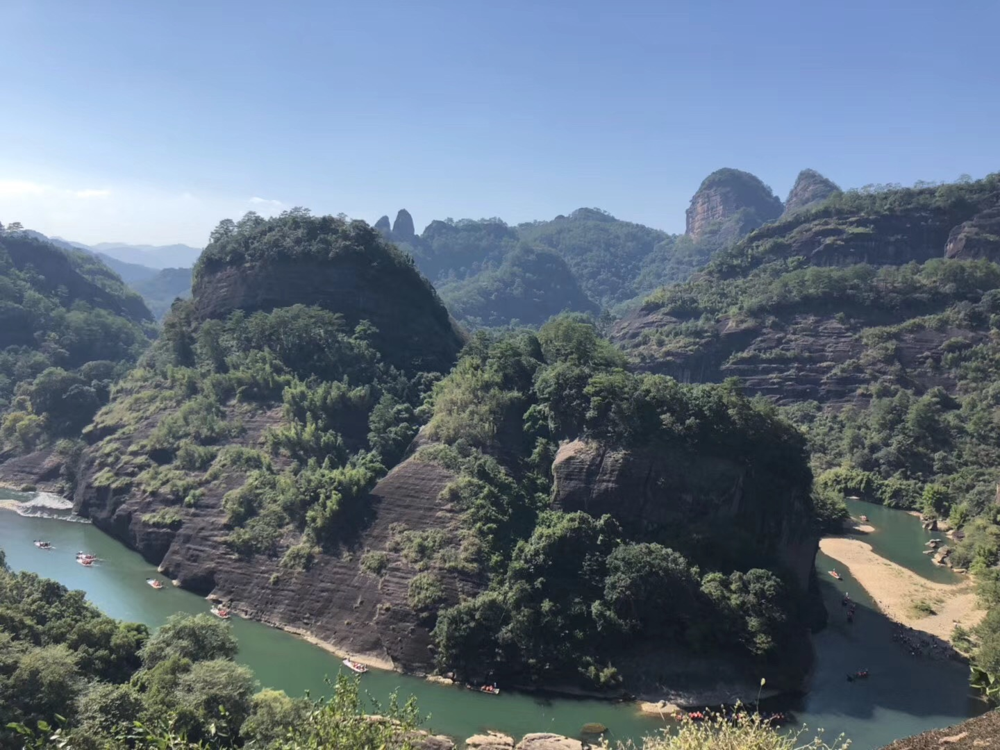
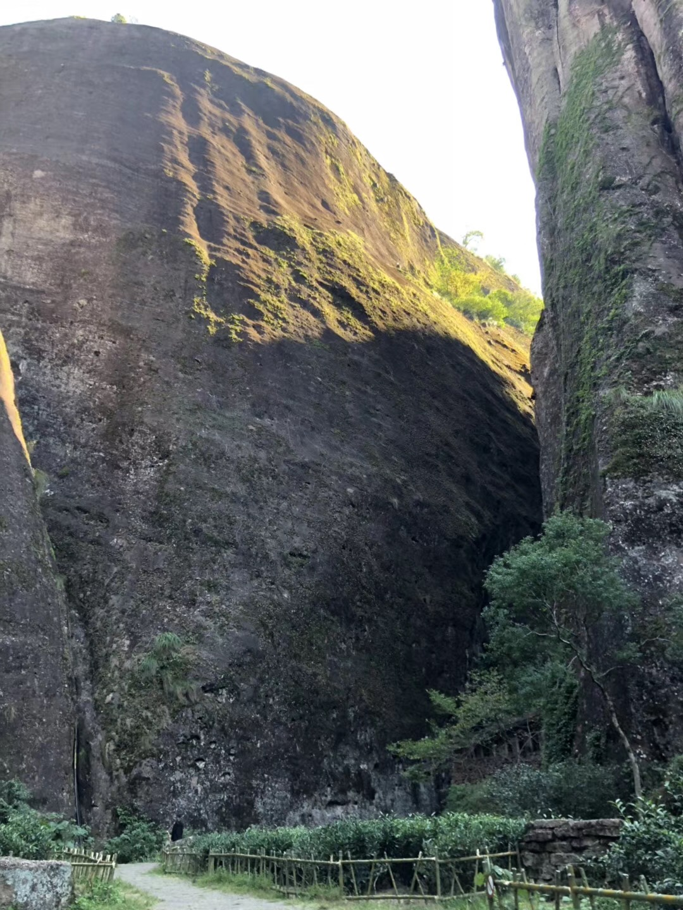
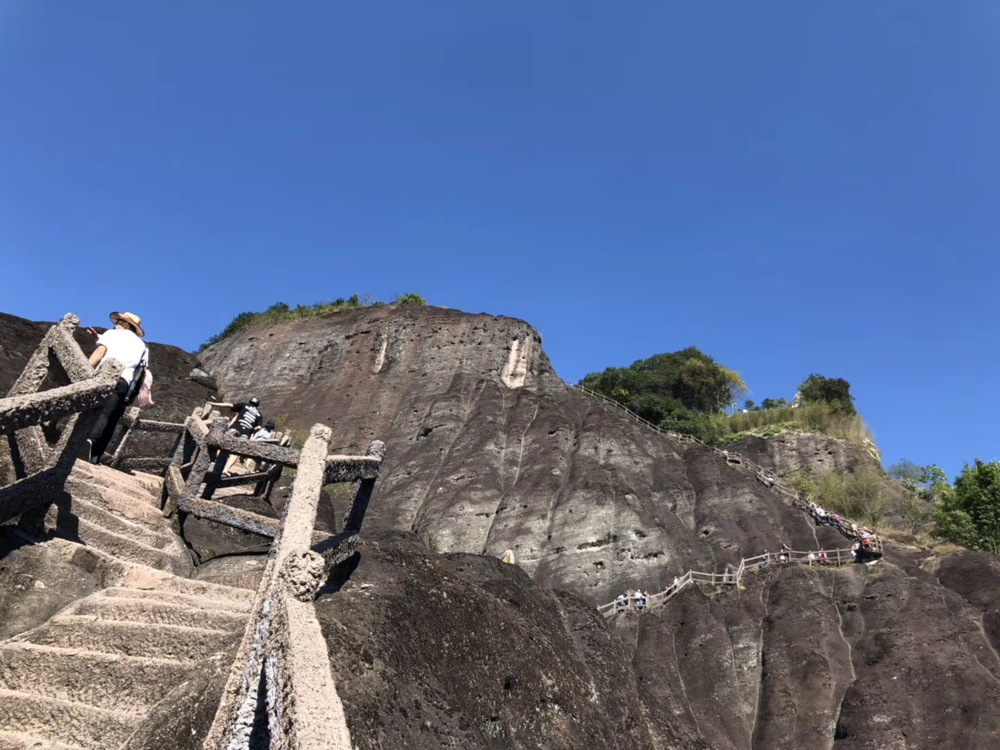
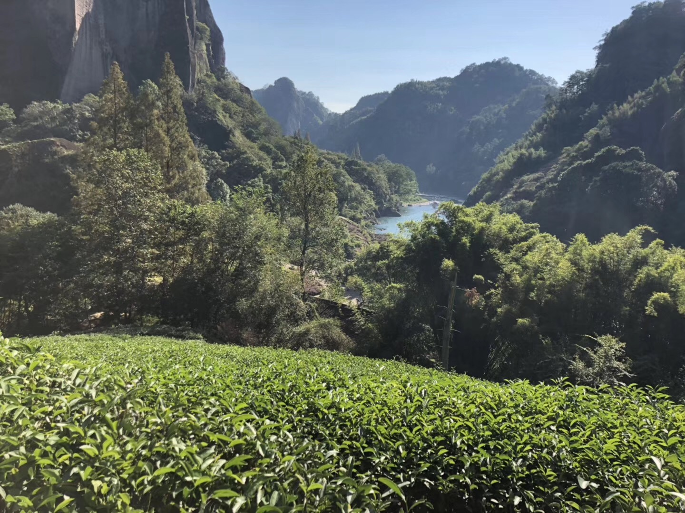
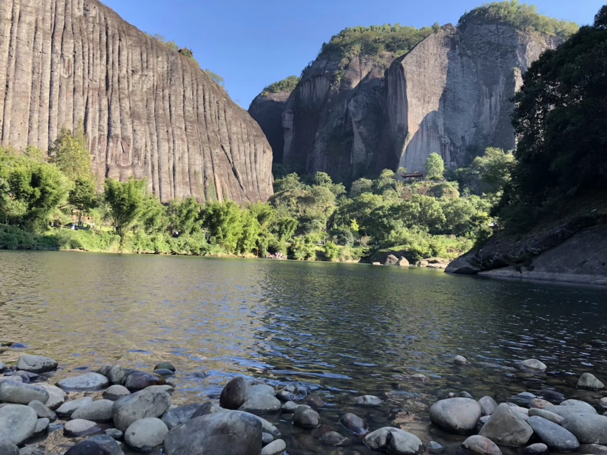
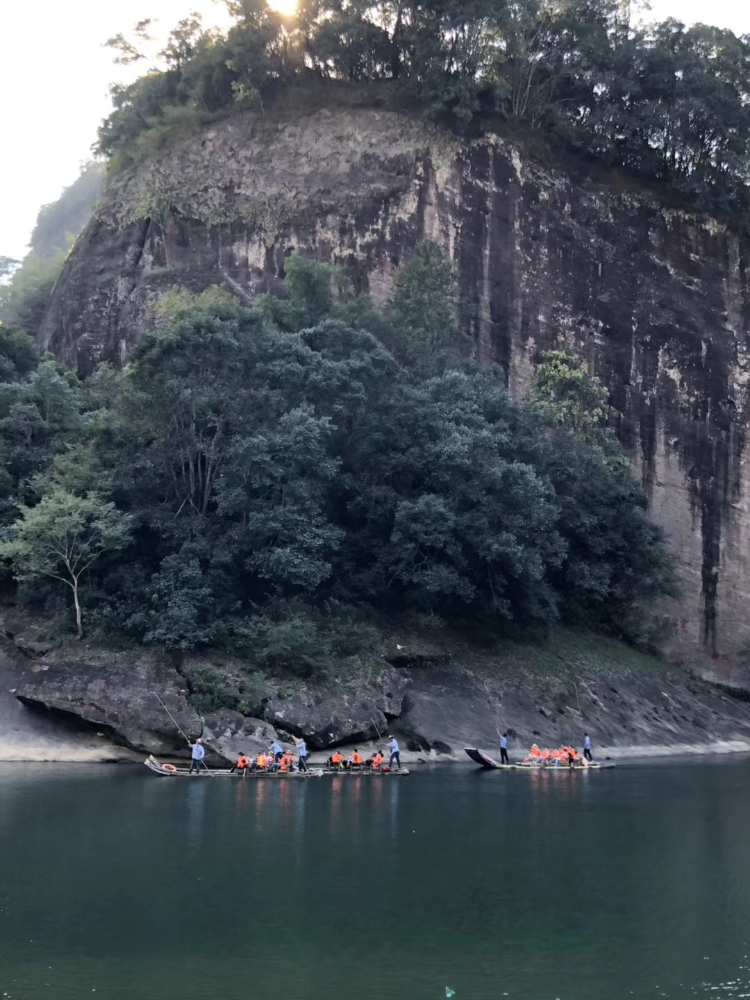
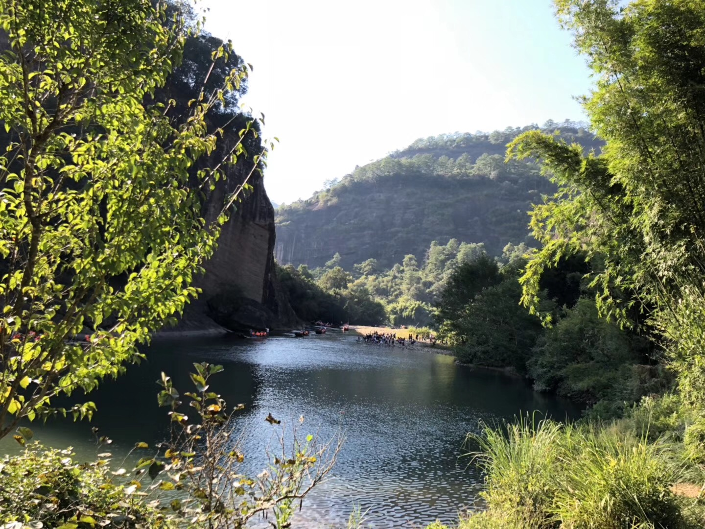
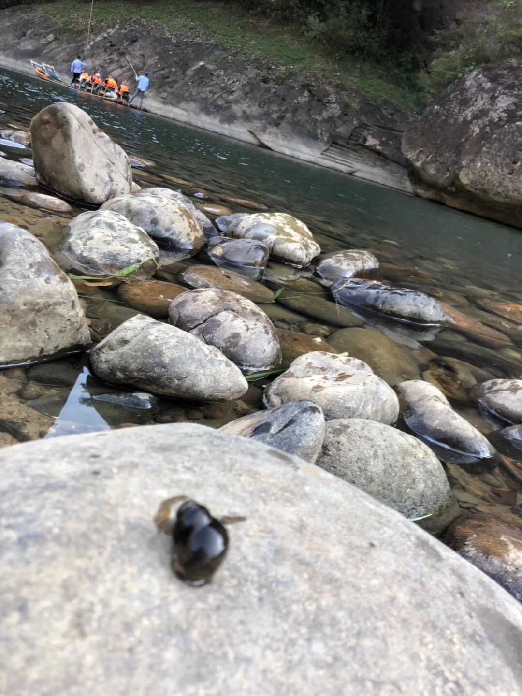

# 武夷山游记

### 武夷山介绍

武夷山市位于福建省北部，地处闽、赣两省交界处，全境东西宽70千米，南北长72.5千米。武夷山“奇秀甲于东南”，为八闽第一胜迹，列首批国家重点风景名胜区。武夷山自然保护区是综合性科研基地，世界闻名的生物标本产地。说到武夷山相信很多人会想到"茶"，[武夷岩茶](https://baike.baidu.com/item/%E6%AD%A6%E5%A4%B7%E5%B2%A9%E8%8C%B6)是武夷山一带生产的乌龙茶类的总称。武夷岩茶系半发酵茶，集红茶、绿茶功效于一身。其中，最为有名的是被誉为‘’茶中之王“的大红袍，因为武夷山是目前全国唯一一个可以生长大红袍的地方，并且仅有几颗而已，极其珍贵，它所产的茶叶一般只有国家领导人才可以享用的到。

### 交通情况

武夷山的交通挺方便的，武夷山东站主要为高铁站，到武夷山景区打车四五十分钟可以到。另外，武夷山还有机场，和其他几个火车站，汽车站等。主要注意的是，当地的出租车司机或者是滴滴司机都是本地人，在车上可能会和你故意聊天，想给你介绍住宿、吃饭或者订景点门票的地方，你可以不用理会，特别是买票还是要去正规的景区售票点。

### 住宿饮食情况

武夷山属于一个旅游发展的城市，旅游行业比较发达。武夷山住宿也很方便，各种酒店和民宿都很多，大家可以提前在网上先预定好酒店或者民宿。我们当时选的当地人开的民宿，叫"半山旅馆"，旅馆的老板是当地人，人还不错，会给你说一些在武夷山旅游时的一些注意事项以及武夷山景点怎么买票的，不过这个旅馆比较偏僻，附近没有什么吃饭的地方，但是离景区还算比较近。

说到吃饭，建议不要去离景区很近的地方，因为离进景区近的一些土菜馆价格都会比较贵而且还不太好吃。这是真的，因为我们就亲身体验了！(宝宝心里苦)  所以建议大家可以网上找下打个车去附件的一些土菜馆吃饭会比较好。还有还有，个人强烈推荐品尝下武夷山熏鹅，特别好吃的哦！如果会吃辣的朋友可以买辣的，虽然是有点辣但是很好吃很好吃的哦！我们就在景区入口那买了点品尝下感觉还不错，如果时间充裕可以到市区买"岚谷熏鹅"，好像这个比较有名。我大学的时候在武夷山站换乘火车，就在那买的他们家熏鹅。

### 景区景点门票

武夷山的景区门票可以提前在网上预定，或者到武夷山景点入口售票处直接买也可以。在网上预定的话大家可以根据自己想游玩的景点订票，我看了下网上的票一般都套票，其中会附带一些你可能不会去的景点或者是晚会，个人感觉到景区售票点买会比较按实际购买。武夷山的门票买一般分三种，一日游，二日游，和三日游套票。如果打算玩两三天的话就直接买二日游或者三日游套票会比较便宜，因为他们就比一日游套票多十几二十块钱，然后你可以连续去两三天。一日游套票里面我觉得选择"景点门票+观光车+竹筏"比较合适，它包括：武夷山门票130元，观光车80元，竹筏130元，总共是340元。如果是二日或三人套票就三百六七十元这样，如果时间宽裕的话，个人建议可以玩两天，可以直接买二日游套票，三天的话感觉没什么必要，因为武夷山主要是去爬各个山峰，连续爬三天的话可能会比较累哦！其实，坐个竹筏和登个一两座比较有名的山峰就可以，比如天游峰、一线天、玉女峰等。我们当时爬的是天游峰，它越往上爬会比较陡，也比较累，当时我们就爬了这坐山，在这玩了一下午，这的风景还是不错的，在山上可以俯瞰九曲溪，下山后可以在九曲溪边玩耍一会儿，还可以看到一个个竹筏从九曲溪中划过。

需要注意的是，如果想做竹筏的话需要提前在网上预定，特别是节假日人多的时候，因为武夷山的竹筏每日有限定人数的，一般大家都提前在网上就预定满了，所以你当天在买是买不到的。个人建议可以坐一下竹筏，因为坐竹筏可以绕着整个武夷山九曲溪游览一遍，这还是很不错的！我们这次去由于没有提前在网上预订，当天去就没有竹筏票了，因此，没有体验一次这竹筏。所以，希望下次去可以坐一下竹筏，想想就美美哒！

### 景点路线

上面就是武夷山景区的一个整体路线图，个人建议可以从景区南入口进去，因为南入口是一个比较大的入口，入口处设有旅客服务中心，各项服务比较齐全，在那可以存放行李，吃些东西。需要注意的是，入口处专门存放行李的柜子在节假日的时候可能不够，但不用担心，你可以考虑往里面走会有很多卖吃的小商店，在那也可以存放行李的。之后，你就做观光车直接到各个景点，大家可以根据自己想去的景点选择不同路线的观光车。武夷山景区可以大致分为这几个路线：天游峰是一个路线，一线天和虎啸岩是一个路线，玉女峰是一个路线。个人感觉，一个路线就可以差不多玩一天了，所以，大家可以合理安排游玩时间哦！观光车运行示意图如下：

### 游玩略影

下面我们来欣赏武夷山的风景照，是不是很美！(是我拍的哟！是不是很有摄影师的潜力，哈哈😆)

以上就是我们这次武夷山游玩的一个小记啦！希望可以给你的游玩提供参考。武夷山，我们应该还会去第二次的，哈哈！一定得坐下竹筏哦！
