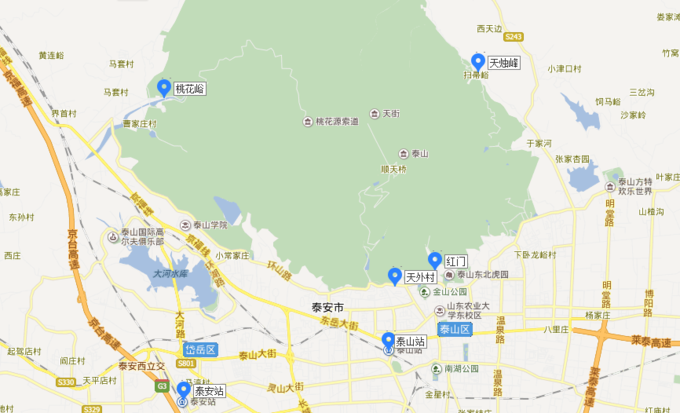

# 泰安自由行

## 如何前往泰山

### 一、泰山的位置：
泰山坐落于泰安市北，是泰安地区标志性景点。想要登泰山，首先要抵达泰安市。由于泰安距离济南不远，而且目前泰安没有民用机场，所以其他城市抵达泰安首选的交通工具是火车。

### 二、泰山站和泰安站的区别：
泰安市一共有两个火车站，购买火车票的时候需要注意的地方就是【泰山站】和【泰安站】并非是同一个车站。具体如何区分这两个车站，可以参考当地人的叫法：泰安站出发的都是动车，当地人都把【泰安站称为高铁站】；泰山站出发的都是普通列车，距离泰安市区最近，所以当地人都把这个车站直接成为【火车站】。

### 三、如何前往登山口：
如果打算从**红门**上山，可直接在泰山站乘坐3路公交车（2元）或乘坐出租车到红门或天外村（车费在10元左右）；若是由泰安站下车，可乘37路公交车至红门或天外村，也可选择乘坐出租车从泰安站至红门或天外村约40分钟左右，车费大约在35元左右。如果选择**桃花峪游览路线**登山，可以从泰山站乘坐16路公交车到达。如果选择**天烛峰游览路线**登山，可以从泰山站乘坐19路公交车到达。

